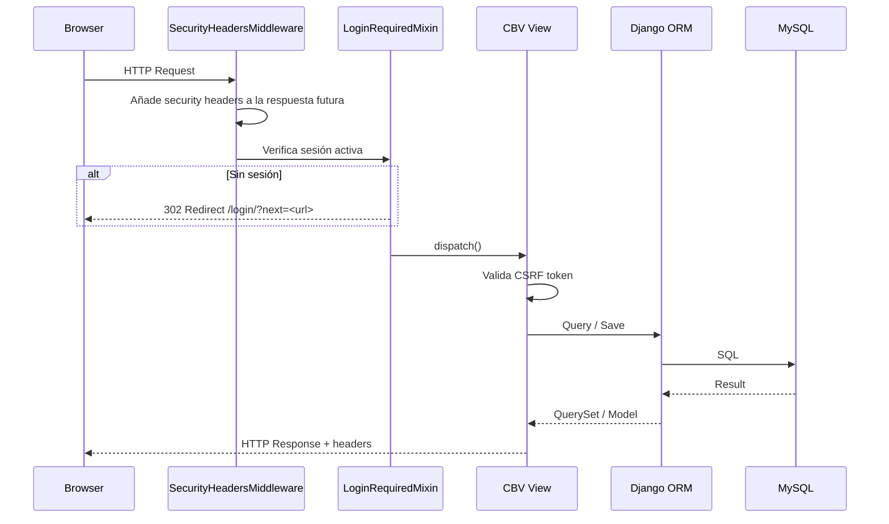
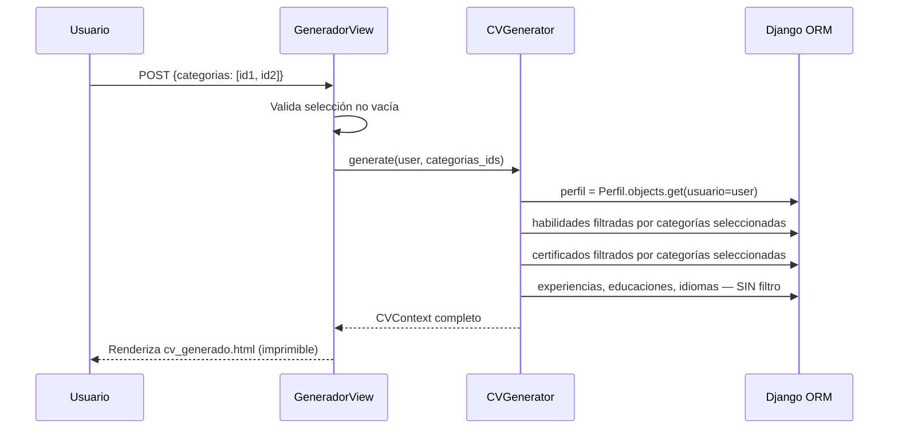
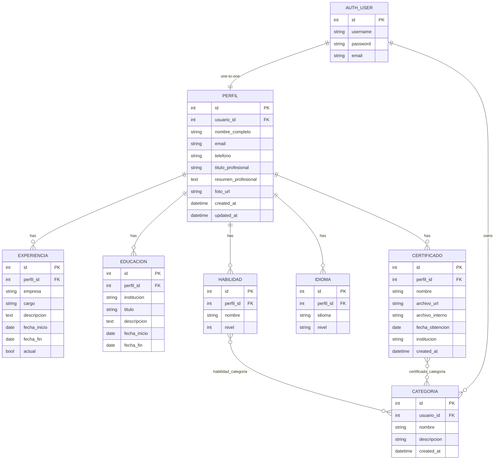

# Design Document — CV Adaptable

## Overview

CV Adaptable es una aplicación web Django orientada a un único usuario profesional (Lenin) que centraliza su perfil completo y permite generar versiones filtradas del CV según las categorías que seleccione para cada oportunidad laboral. El MVP se despliega en hosting compartido (PythonAnywhere) con almacenamiento local de archivos.

**Objetivos de diseño:**

- Perfil único maestro que sirve de fuente de verdad para todas las versiones del CV.
- Filtrado por categorías: habilidades y certificados se etiquetan con categorías; el generador extrae solo los elementos de las categorías seleccionadas.
- Seguridad integrada desde el diseño (no como parche): CSRF, ownership checks, headers HTTP, variables de entorno.
- Firma visual consistente: gradientes de header azul `#11cdef → #1171ef`, botones verdes `#11f577 → #0ba85d`, botones secundarios púrpura/rosa.
- Interfaz responsive mobile-first con Bootstrap 5 y validación en tiempo real con jQuery Validate.

---

## Architecture

### Diagrama de componentes

```mermaid
graph TB
    subgraph Browser
        UI[Bootstrap 5 + jQuery Validate]
    end

    subgraph Django App — cv_adaptable
        subgraph core
            BASE[base.html + dashboard]
            AUTH[Django Auth — login/logout]
            SEC[SecurityHeadersMiddleware]
        end

        subgraph perfil
            PVIEWS[Perfil CBV]
            PFORMS[ModelForms + Validator]
        end

        subgraph certificados
            CVIEWS[Certificado CBV]
            CATVIEWS[Categoria CBV]
            FH[FileHandler]
            SERVE[CertificadoServeView — ownership check]
        end

        subgraph generador
            GVIEW[GeneradorView]
            CVVIEW[CVPreviewView]
            GEN[CVGenerator]
        end
    end

    subgraph Data Layer
        ORM[Django ORM]
        DB[(MySQL)]
        FS[Sistema de archivos — fuera de raíz web]
    end

    UI -->|HTTP/HTTPS| core
    UI -->|form submit| perfil
    UI -->|form submit| certificados
    UI -->|form submit| generador
    AUTH --> SEC
    PVIEWS --> PFORMS
    PFORMS --> ORM
    CVIEWS --> FH
    FH --> FS
    CVIEWS --> ORM
    CATVIEWS --> ORM
    GVIEW --> GEN
    GEN --> ORM
    ORM --> DB
    SERVE --> FS
```

### Flujo de petición HTTP



### Flujo de generación de CV filtrado



---

## Components and Interfaces

### Apps Django y responsabilidades

| App | Responsabilidad |
|-----|----------------|
| `core` | Configuración de proyecto, templates base, dashboard, middleware de seguridad, vistas de autenticación |
| `perfil` | CRUD de Perfil, Experiencia, Educación, Habilidad, Idioma |
| `certificados` | CRUD de Certificado y Categoría, FileHandler, serving seguro de PDFs |
| `generador` | Vista previa estándar, generación de CV filtrado por categorías |

### URL Design

```
/                               → redirect a /dashboard/ si autenticado, si no a /login/
/login/                         → LoginView (core)
/logout/                        → LogoutView (core)
/dashboard/                     → DashboardView (core)

/perfil/                        → ProfileUpdateView
/perfil/experiencia/            → ExperienciaListView
/perfil/experiencia/nueva/      → ExperienciaCreateView
/perfil/experiencia/<pk>/editar/   → ExperienciaUpdateView
/perfil/experiencia/<pk>/eliminar/ → ExperienciaDeleteView
/perfil/educacion/              → EducacionListView
/perfil/educacion/nueva/        → EducacionCreateView
/perfil/educacion/<pk>/editar/  → EducacionUpdateView
/perfil/educacion/<pk>/eliminar/ → EducacionDeleteView
/perfil/habilidades/            → HabilidadListView
/perfil/habilidades/nueva/      → HabilidadCreateView
/perfil/habilidades/<pk>/editar/ → HabilidadUpdateView
/perfil/habilidades/<pk>/eliminar/ → HabilidadDeleteView
/perfil/idiomas/                → IdiomaListView
/perfil/idiomas/nuevo/          → IdiomaCreateView
/perfil/idiomas/<pk>/editar/    → IdiomaUpdateView
/perfil/idiomas/<pk>/eliminar/  → IdiomaDeleteView

/certificados/                  → CertificadoListView
/certificados/subir/            → CertificadoCreateView
/certificados/<pk>/eliminar/    → CertificadoDeleteView
/certificados/archivo/<pk>/     → CertificadoServeView (ownership check)
/categorias/                    → CategoriaListView
/categorias/nueva/              → CategoriaCreateView
/categorias/<pk>/editar/        → CategoriaUpdateView
/categorias/<pk>/eliminar/      → CategoriaDeleteView

/cv/preview/                    → CVPreviewView
/cv/generar/                    → CVGeneradorView (GET: formulario, POST: resultado)
```

### Class-Based Views — interfaces clave

```python
# perfil/views.py

class ProfileUpdateView(LoginRequiredMixin, UpdateView):
    model = Perfil
    form_class = PerfilForm
    template_name = 'perfil/perfil_form.html'

    def get_object(self):
        return get_object_or_404(Perfil, usuario=self.request.user)


class ExperienciaCreateView(LoginRequiredMixin, CreateView):
    model = Experiencia
    form_class = ExperienciaForm
    template_name = 'perfil/experiencia_form.html'

    def form_valid(self, form):
        form.instance.perfil = get_object_or_404(Perfil, usuario=self.request.user)
        return super().form_valid(form)


# certificados/views.py

class CertificadoCreateView(LoginRequiredMixin, CreateView):
    model = Certificado
    form_class = CertificadoForm
    template_name = 'certificados/certificado_form.html'

    def form_valid(self, form):
        perfil = get_object_or_404(Perfil, usuario=self.request.user)
        form.instance.perfil = perfil
        archivo = self.request.FILES['archivo']
        form.instance.archivo_interno = FileHandler.store(archivo)
        return super().form_valid(form)


class CertificadoServeView(LoginRequiredMixin, View):
    """Sirve el archivo PDF previa verificación de ownership."""
    def get(self, request, pk):
        cert = get_object_or_404(Certificado, pk=pk)
        if cert.perfil.usuario != request.user:
            raise PermissionDenied
        return FileHandler.serve(cert.archivo_interno)


# generador/views.py

class CVGeneradorView(LoginRequiredMixin, FormView):
    template_name = 'generador/generador.html'
    form_class = CategoriaSeleccionForm

    def form_valid(self, form):
        categorias_ids = form.cleaned_data['categorias']
        context = CVGenerator.generate(self.request.user, categorias_ids)
        return render(self.request, 'generador/cv_generado.html', context)
```

### FileHandler

```python
# certificados/file_handler.py

import os
import uuid
import magic  # python-magic

class FileHandler:
    ALLOWED_MIME = 'application/pdf'
    ALLOWED_EXT = '.pdf'
    MAX_SIZE_BYTES = 5 * 1024 * 1024  # 5 MB
    UPLOAD_DIR = '/home/user/cv_uploads/'  # fuera de raíz web — configurado en settings

    @classmethod
    def validate(cls, uploaded_file):
        """Valida MIME, extensión y tamaño. Lanza ValidationError si falla."""
        ext = os.path.splitext(uploaded_file.name)[1].lower()
        if ext != cls.ALLOWED_EXT:
            raise ValidationError("Solo se permiten archivos PDF.")
        if uploaded_file.size > cls.MAX_SIZE_BYTES:
            raise ValidationError("El archivo supera el límite de 5 MB.")
        mime = magic.from_buffer(uploaded_file.read(1024), mime=True)
        uploaded_file.seek(0)
        if mime != cls.ALLOWED_MIME:
            raise ValidationError("Solo se permiten archivos PDF.")

    @classmethod
    def store(cls, uploaded_file):
        """Valida y guarda el archivo con nombre interno UUID."""
        cls.validate(uploaded_file)
        internal_name = f"{uuid.uuid4()}.pdf"
        dest = os.path.join(cls.UPLOAD_DIR, internal_name)
        with open(dest, 'wb+') as f:
            for chunk in uploaded_file.chunks():
                f.write(chunk)
        return internal_name

    @classmethod
    def serve(cls, internal_name):
        """Retorna FileResponse para el archivo dado."""
        path = os.path.join(cls.UPLOAD_DIR, internal_name)
        return FileResponse(open(path, 'rb'), content_type='application/pdf')

    @classmethod
    def delete(cls, internal_name):
        """Elimina el archivo físico del sistema de archivos."""
        path = os.path.join(cls.UPLOAD_DIR, internal_name)
        if os.path.exists(path):
            os.remove(path)
```

### SecurityHeadersMiddleware

```python
# core/middleware.py

class SecurityHeadersMiddleware:
    def __init__(self, get_response):
        self.get_response = get_response

    def __call__(self, request):
        response = self.get_response(request)
        response['X-Content-Type-Options'] = 'nosniff'
        response['X-Frame-Options'] = 'DENY'
        response['X-XSS-Protection'] = '1; mode=block'
        return response
```

### CVGenerator

```python
# generador/generator.py

class CVGenerator:
    @staticmethod
    def generate(user, categorias_ids: list) -> dict:
        perfil = Perfil.objects.select_related('usuario').get(usuario=user)
        habilidades = (
            Habilidad.objects
            .filter(perfil=perfil, categorias__id__in=categorias_ids)
            .distinct()
        )
        certificados = (
            Certificado.objects
            .filter(perfil=perfil, categorias__id__in=categorias_ids)
            .distinct()
        )
        experiencias = (
            Experiencia.objects
            .filter(perfil=perfil)
            .order_by('-fecha_inicio')
        )
        educaciones = (
            Educacion.objects
            .filter(perfil=perfil)
            .order_by('-fecha_inicio')
        )
        idiomas = Idioma.objects.filter(perfil=perfil)
        return {
            'perfil': perfil,
            'experiencias': experiencias,
            'educaciones': educaciones,
            'habilidades': habilidades,
            'idiomas': idiomas,
            'certificados': certificados,
        }
```

### Template Structure

```
templates/
├── base.html                         # Layout principal — navbar, firma visual, bloques
├── base_print.html                   # Layout impresión — sin nav, A4, @media print
├── core/
│   ├── login.html
│   └── dashboard.html
├── perfil/
│   ├── perfil_form.html
│   ├── experiencia_list.html
│   ├── experiencia_form.html
│   ├── educacion_list.html
│   ├── educacion_form.html
│   ├── habilidad_list.html
│   ├── habilidad_form.html
│   ├── idioma_list.html
│   └── idioma_form.html
├── certificados/
│   ├── certificado_list.html
│   ├── certificado_form.html
│   ├── categoria_list.html
│   └── categoria_form.html
└── generador/
    ├── generador.html                # Selector de categorías
    ├── cv_preview.html               # Vista previa estándar (extends base_print.html)
    └── cv_generado.html              # CV filtrado (extends base_print.html)
```

**Firma visual en base.html:**

```html
<!-- Header gradiente azul -->
<header style="background: linear-gradient(135deg, #11cdef 0%, #1171ef 100%);">

<!-- Botones primarios — verde -->
<button class="btn-cv-primary">
  <!-- background: linear-gradient(135deg, #11f577 0%, #0ba85d 100%) -->
</button>

<!-- Botones secundarios — púrpura/rosa -->
<button class="btn-cv-secondary">
  <!-- background: linear-gradient(135deg, #a855f7 0%, #ec4899 100%) -->
</button>
```

---

## Data Models

### Diagrama Entidad-Relación



### Django Models

```python
# perfil/models.py

from django.db import models
from django.contrib.auth.models import User
from django.core.validators import MinValueValidator, MaxValueValidator


class Perfil(models.Model):
    usuario = models.OneToOneField(User, on_delete=models.CASCADE, related_name='perfil')
    nombre_completo = models.CharField(max_length=100)
    email = models.EmailField(max_length=254)
    telefono = models.CharField(max_length=20)
    titulo_profesional = models.CharField(max_length=100)
    resumen_profesional = models.TextField(max_length=1000)
    foto_url = models.URLField(blank=True)
    created_at = models.DateTimeField(auto_now_add=True)
    updated_at = models.DateTimeField(auto_now=True)

    class Meta:
        db_table = 'perfil'
        indexes = [models.Index(fields=['usuario'], name='idx_perfil_usuario')]

    def __str__(self):
        return self.nombre_completo


class Experiencia(models.Model):
    perfil = models.ForeignKey(Perfil, on_delete=models.CASCADE, related_name='experiencias')
    empresa = models.CharField(max_length=100)
    cargo = models.CharField(max_length=100)
    descripcion = models.TextField(blank=True)
    fecha_inicio = models.DateField()
    fecha_fin = models.DateField(null=True, blank=True)
    actual = models.BooleanField(default=False)

    class Meta:
        db_table = 'experiencia'
        indexes = [models.Index(fields=['perfil'], name='idx_experiencia_perfil')]
        ordering = ['-fecha_inicio']

    def clean(self):
        from django.core.exceptions import ValidationError
        if self.fecha_fin and self.fecha_inicio and self.fecha_fin < self.fecha_inicio:
            raise ValidationError(
                {'fecha_fin': 'La fecha de fin no puede ser anterior a la de inicio.'}
            )


class Educacion(models.Model):
    perfil = models.ForeignKey(Perfil, on_delete=models.CASCADE, related_name='educaciones')
    institucion = models.CharField(max_length=200)
    titulo = models.CharField(max_length=200)
    descripcion = models.TextField(blank=True)
    fecha_inicio = models.DateField()
    fecha_fin = models.DateField(null=True, blank=True)

    class Meta:
        db_table = 'educacion'
        ordering = ['-fecha_inicio']

    def clean(self):
        from django.core.exceptions import ValidationError
        if self.fecha_fin and self.fecha_inicio and self.fecha_fin < self.fecha_inicio:
            raise ValidationError(
                {'fecha_fin': 'La fecha de fin no puede ser anterior a la de inicio.'}
            )


class Habilidad(models.Model):
    perfil = models.ForeignKey(Perfil, on_delete=models.CASCADE, related_name='habilidades')
    nombre = models.CharField(max_length=100)
    nivel = models.IntegerField(
        validators=[MinValueValidator(1), MaxValueValidator(5)],
        default=3
    )
    categorias = models.ManyToManyField(
        'certificados.Categoria', blank=True, related_name='habilidades'
    )

    class Meta:
        db_table = 'habilidad'
        constraints = [
            models.UniqueConstraint(
                fields=['perfil', 'nombre'],
                name='unique_habilidad_perfil'
            )
        ]

    def __str__(self):
        return self.nombre


class Idioma(models.Model):
    NIVEL_CHOICES = [
        ('Básico', 'Básico'),
        ('Intermedio', 'Intermedio'),
        ('Avanzado', 'Avanzado'),
        ('Nativo', 'Nativo'),
    ]
    perfil = models.ForeignKey(Perfil, on_delete=models.CASCADE, related_name='idiomas')
    idioma = models.CharField(max_length=100)
    nivel = models.CharField(max_length=20, choices=NIVEL_CHOICES)

    class Meta:
        db_table = 'idioma'


# certificados/models.py

class Categoria(models.Model):
    usuario = models.ForeignKey(User, on_delete=models.CASCADE, related_name='categorias')
    nombre = models.CharField(max_length=100)
    descripcion = models.TextField(blank=True)
    created_at = models.DateTimeField(auto_now_add=True)

    class Meta:
        db_table = 'categoria'
        constraints = [
            models.UniqueConstraint(
                fields=['usuario', 'nombre'],
                name='unique_categoria_usuario'
            )
        ]

    def __str__(self):
        return self.nombre


class Certificado(models.Model):
    perfil = models.ForeignKey(
        'perfil.Perfil', on_delete=models.CASCADE, related_name='certificados'
    )
    nombre = models.CharField(max_length=255)
    archivo_url = models.CharField(max_length=255, blank=True)    # nombre original sanitizado
    archivo_interno = models.CharField(max_length=255)             # UUID.pdf — fuera de raíz web
    fecha_obtencion = models.DateField(null=True, blank=True)
    institucion = models.CharField(max_length=200, blank=True)
    categorias = models.ManyToManyField(Categoria, blank=True, related_name='certificados')
    created_at = models.DateTimeField(auto_now_add=True)

    class Meta:
        db_table = 'certificado'
        indexes = [models.Index(fields=['perfil'], name='idx_certificado_perfil')]
```

### Decisiones de diseño — base de datos

| Decisión | Justificación |
|----------|--------------|
| `UniqueConstraint(perfil, nombre)` en Habilidad | Req. 5.2 — unicidad por usuario; la validación case-insensitive se implementa con `iexact` en el form (MySQL en modo case-insensitive también la aplica a nivel DB) |
| `UniqueConstraint(usuario, nombre)` en Categoria | Req. 8.5 — nombres únicos por usuario |
| `ordering = ['-fecha_inicio']` en Experiencia y Educacion | Req. 3.6 y 4.10 — orden cronológico descendente integrado en el modelo |
| `archivo_interno` separado de `archivo_url` | `archivo_url` muestra el nombre original al usuario; `archivo_interno` es el UUID que se usa internamente — Req. 7.4 |
| Categoria FK a `auth.User` (no a Perfil) | Las categorías son del usuario directamente; el ownership check es inmediato sin join extra |
| `transaction.atomic()` en eliminación de Certificado | Req. 7.6 — atomicidad entre borrado en DB y borrado en disco |

---

## Correctness Properties

*Una propiedad es una característica o comportamiento que debe cumplirse en todas las ejecuciones válidas del sistema — esencialmente, una afirmación formal sobre lo que el sistema debe hacer. Las propiedades son el puente entre especificaciones legibles por humanos y garantías de corrección verificables por máquinas.*

---

### Property 1: Filtrado de CV produce exactamente los elementos de las categorías seleccionadas

*Para cualquier* perfil con un conjunto arbitrario de habilidades y certificados distribuidos entre categorías, y para cualquier subconjunto no vacío de categorías seleccionadas, el CV_Generado debe contener exactamente las habilidades cuyas categorías intersectan con la selección y exactamente los certificados cuyas categorías intersectan con la selección — sin elementos de más ni de menos.

**Validates: Requirements 10.2**

---

### Property 2: El CV_Generado siempre incluye la totalidad de los datos no filtrados

*Para cualquier* usuario y cualquier selección válida de categorías, el CV_Generado debe incluir siempre la totalidad del Perfil, la totalidad de las Experiencias, la totalidad de las Educaciones y la totalidad de los Idiomas del usuario, independientemente de qué categorías se seleccionen.

**Validates: Requirements 10.2**

---

### Property 3: Validación de rango de fechas es consistente para Experiencia y Educación

*Para cualquier* par de fechas (fecha_inicio, fecha_fin) proporcionado en un registro de Experiencia o Educación: si fecha_fin es anterior a fecha_inicio, el Validator debe rechazar el guardado con un error en el campo fecha_fin; si fecha_fin es igual o posterior a fecha_inicio, el Validator no debe producir un error de rango.

**Validates: Requirements 3.5, 4.7**

---

### Property 4: Validación de nombres únicos rechaza duplicados ignorando capitalización

*Para cualquier* nombre N ya registrado como Habilidad (o Categoría) de un usuario, intentar crear otra Habilidad (o Categoría) con cualquier variación de capitalización de N para el mismo usuario debe ser rechazado por el Validator sin persistir ningún cambio.

**Validates: Requirements 5.2, 5.3, 8.5**

---

### Property 5: Eliminar una Categoría preserva todos los elementos asociados y solo remueve la asociación

*Para cualquier* Categoría C con un conjunto arbitrario de Habilidades y Certificados asociados, al eliminar C: (a) todos los registros de Habilidad previamente asociados a C deben seguir existiendo en la base de datos, (b) todos los registros de Certificado previamente asociados a C deben seguir existiendo, y (c) ninguno de ellos debe mantener la asociación con C en sus relaciones M2M.

**Validates: Requirements 5.7, 5.8, 8.3**

---

### Property 6: El FileHandler rechaza cualquier archivo que no sea PDF válido o exceda el tamaño máximo

*Para cualquier* archivo cuyo tipo MIME detectado no sea `application/pdf`, o cuya extensión no sea `.pdf`, o cuyo tamaño supere 5 MB, el método `FileHandler.validate()` debe lanzar una `ValidationError` y no debe escribir ningún byte en el sistema de archivos ni registrar nada en la base de datos.

**Validates: Requirements 7.1, 7.2, 7.3**

---

### Property 7: El nombre de archivo almacenado es siempre un UUID distinto al nombre original

*Para cualquier* archivo PDF válido subido por el usuario con cualquier nombre original N, el `archivo_interno` generado por `FileHandler.store()` debe ser de la forma `<UUID>.pdf` donde el UUID es único y distinto a cualquier forma derivada de N.

**Validates: Requirements 7.4**

---

### Property 8: Los security headers están presentes en todas las respuestas HTTP

*Para cualquier* endpoint del sistema (URL protegida, URL pública, respuesta de error), la respuesta HTTP producida por `SecurityHeadersMiddleware` debe contener exactamente los headers `X-Content-Type-Options: nosniff`, `X-Frame-Options: DENY` y `X-XSS-Protection: 1; mode=block`, independientemente del código de estado de la respuesta.

**Validates: Requirements 11.1**

---

### Property 9: El ownership check deniega el acceso a archivos de usuarios no propietarios

*Para cualquier* Certificado con propietario U1, una solicitud de acceso al archivo (`GET /certificados/archivo/<pk>/`) realizada por cualquier usuario autenticado U2 donde U2 ≠ U1 debe retornar HTTP 403 sin entregar el contenido del archivo ni revelar su ruta en el sistema de archivos.

**Validates: Requirements 11.3, 11.4**

---

## Error Handling

### Estrategia por nivel de error

| Nivel | Tipo | Respuesta |
|-------|------|-----------|
| **Validación** | Campos inválidos, archivos rechazados, CSRF inválido | Re-renderiza el formulario con mensajes específicos por campo; conserva los valores ingresados |
| **Autorización** | Sin sesión activa | Redirect a `/login/?next=<url>` |
| **Autorización** | Ownership fallido | HTTP 403 sin revelar detalles del archivo |
| **Error de servidor** | Excepción no controlada, fallo de I/O | Página de error genérica (DEBUG=False); sin trazas internas |

### Casos específicos

**Autenticación (Req. 1):**
- Credenciales inválidas → mensaje genérico "Usuario o contraseña incorrectos" (sin revelar cuál campo falló).
- 5 intentos fallidos → bloqueo de 15 minutos. Implementado con [`django-axes`](https://django-axes.readthedocs.io/) (sin costo, mantenido activamente).
- CSRF inválido → HTTP 403 con mensaje "La solicitud no pudo procesarse."

**Formularios de perfil y secciones (Req. 2–6):**
- Campo obligatorio vacío → `ValidationError` con texto indicando el campo específico.
- Valor fuera de límite de caracteres → mensaje con el límite permitido (ej: "Máximo 100 caracteres").
- Fecha con formato inválido → "Debe ser una fecha válida."
- Rango de fechas inválido → "La fecha de fin no puede ser anterior a la de inicio."
- Habilidad duplicada (case-insensitive) → "Ya existe una habilidad con ese nombre."
- Categoría duplicada (case-insensitive) → "Ya existe una categoría con ese nombre."
- Nivel de idioma fuera de choices → rechazado por Django antes de llegar a la view.

**Archivos (Req. 7):**
- Tipo MIME o extensión inválidos → "Solo se permiten archivos PDF."
- Tamaño > 5 MB → "El archivo supera el límite de 5 MB."
- Nombre de archivo > 255 caracteres → "El nombre del archivo es demasiado largo."
- Fallo al escribir en disco → `transaction.atomic()` hace rollback del registro DB; mensaje "El certificado no pudo guardarse. Intente de nuevo."

**Eliminación de Certificado (Req. 7.6):**

```python
from django.db import transaction

def post(self, request, pk):
    cert = get_object_or_404(Certificado, pk=pk, perfil__usuario=request.user)
    archivo_interno = cert.archivo_interno
    try:
        with transaction.atomic():
            cert.delete()
            FileHandler.delete(archivo_interno)
    except Exception:
        messages.error(request, "El certificado no pudo eliminarse. Intente de nuevo.")
        return redirect('certificados:lista')
    messages.success(request, "Certificado eliminado.")
    return redirect('certificados:lista')
```

**Generador (Req. 10):**
- Ninguna categoría seleccionada → mensaje "Debe seleccionar al menos una Categoría."
- Perfil no encontrado durante generación → mensaje "No fue posible generar el CV." sin renderizar página parcial.

**Serving de archivos (Req. 11):**
- Usuario no propietario → `PermissionDenied` (HTTP 403) sin revelar ruta ni existencia del archivo.
- Archivo físico no encontrado (inconsistencia DB/disco) → HTTP 404 genérico.

### Configuración de producción

```python
# settings/production.py

DEBUG = False
ALLOWED_HOSTS = ['username.pythonanywhere.com']

SECRET_KEY = os.environ['DJANGO_SECRET_KEY']

DATABASES = {
    'default': {
        'ENGINE': 'django.db.backends.mysql',
        'NAME': os.environ['DB_NAME'],
        'USER': os.environ['DB_USER'],
        'PASSWORD': os.environ['DB_PASSWORD'],
        'HOST': os.environ['DB_HOST'],
        'PORT': os.environ.get('DB_PORT', '3306'),
        'OPTIONS': {'charset': 'utf8mb4'},
    }
}

MIDDLEWARE = [
    'django.middleware.security.SecurityMiddleware',
    'core.middleware.SecurityHeadersMiddleware',
    'django.contrib.sessions.middleware.SessionMiddleware',
    'django.middleware.common.CommonMiddleware',
    'django.middleware.csrf.CsrfViewMiddleware',
    'django.contrib.auth.middleware.AuthenticationMiddleware',
    'axes.middleware.AxesMiddleware',  # django-axes — debe ir después de AuthenticationMiddleware
    ...
]

SESSION_COOKIE_AGE = 28800         # 8 horas
SESSION_COOKIE_HTTPONLY = True
SESSION_COOKIE_SECURE = True       # HTTPS only
CSRF_COOKIE_SECURE = True

# django-axes
AXES_FAILURE_LIMIT = 5
AXES_COOLOFF_TIME = 0.25           # 15 minutos (en horas)
AXES_LOCKOUT_PARAMETERS = ['username']
```

---

## Testing Strategy

### Enfoque dual: Unit Tests + Property-Based Tests

La estrategia combina tests de ejemplo concretos (comportamientos específicos, edge cases, integraciones) con tests de propiedades (cobertura universal del espacio de inputs).

**Librería PBT elegida:** [Hypothesis](https://hypothesis.readthedocs.io/) — Python nativo, integración directa con Django (`hypothesis.extra.django`), sin costo, mantenida activamente.

Cada property test corre un mínimo de **100 iteraciones** (`@settings(max_examples=100)`).

Tag de referencia por test:
```python
# Feature: cv-adaptable, Property N: <texto de la propiedad>
```

---

### Unit Tests

**Autenticación y seguridad (Req. 1, 11):**

```python
def test_login_credenciales_validas_redirige_dashboard():
    # Credenciales válidas → 302 a /dashboard/

def test_login_credenciales_invalidas_mensaje_generico():
    # No revela si es usuario o contraseña

def test_cinco_intentos_fallidos_bloquean_cuenta():
    # Bloqueo activado en el 5to intento

def test_logout_destruye_sesion_redirige_login():
    # Sesión inexistente post-logout, 302 a /login/

def test_csrf_invalido_retorna_403():
    # POST sin csrftoken → 403

def test_security_headers_presentes_en_login_page():
    # GET /login/ → verifica los 3 headers

def test_ownership_propietario_recibe_archivo():
    # El propietario obtiene 200 y el archivo

def test_ownership_no_propietario_recibe_403():
    # Usuario distinto obtiene 403
```

**Perfil y secciones (Req. 2–6):**

```python
def test_perfil_carga_datos_existentes():
    # GET /perfil/ con perfil guardado → formulario precargado

def test_experiencia_lista_con_datos_vacios():
    # Sin experiencias → muestra mensaje de sección vacía

def test_educacion_independencia_crud():
    # Crear 3 educaciones, editar 1, las otras 2 intactas

def test_idioma_nivel_invalido_rechazado():
    # POST con nivel="Experto" → ValidationError

def test_habilidad_eliminacion_no_afecta_categorias():
    # Eliminar habilidad → categorías persisten

def test_certificado_sin_categorias_disponibles_permite_subida():
    # Req. 7.8 — sin categorías registradas, la subida funciona con aviso
```

**Generador (Req. 9, 10):**

```python
def test_cv_preview_sin_datos_muestra_mensajes_por_seccion():
    # Req. 9.1 — secciones vacías con mensaje, no omitidas

def test_generador_sin_seleccion_muestra_error():
    # POST vacío → error visible, mismo formulario

def test_cv_generado_orden_secciones():
    # Verifica orden: Perfil > Resumen > Exp > Edu > Habilidades > Idiomas > Certificados

def test_generador_fallo_datos_no_renderiza_parcial():
    # Mock ORM lanza excepción → mensaje de error, no HTML parcial
```

---

### Property-Based Tests (Hypothesis)

```python
# tests/test_properties.py

from hypothesis import given, settings
from hypothesis import strategies as st
from hypothesis.extra.django import from_model, TestCase
from datetime import date


# ------------------------------------------------------------------
# Property 1: Filtrado produce exactamente los elementos de las
#             categorías seleccionadas
# Feature: cv-adaptable, Property 1
# ------------------------------------------------------------------
@given(
    categorias_disponibles=st.lists(st.integers(min_value=1, max_value=20), min_size=1, unique=True),
    seleccion=st.lists(st.integers(min_value=1, max_value=20), min_size=1, unique=True),
)
@settings(max_examples=100)
def test_filtrado_cv_habilidades_exactas(categorias_disponibles, seleccion):
    """
    Para cualquier distribución de habilidades en categorías y cualquier selección,
    el CV contiene exactamente las habilidades cuyas categorías intersectan la selección.
    """
    seleccion_set = set(seleccion) & set(categorias_disponibles)
    if not seleccion_set:
        return
    # Setup: crear perfil, habilidades con categorías asignadas, ejecutar CVGenerator
    resultado = CVGenerator.generate(user, list(seleccion_set))
    habilidades_esperadas = {
        h for h in todas_las_habilidades
        if set(h.categorias.values_list('id', flat=True)) & seleccion_set
    }
    assert set(resultado['habilidades']) == habilidades_esperadas


# ------------------------------------------------------------------
# Property 2: CV siempre incluye datos no filtrados completos
# Feature: cv-adaptable, Property 2
# ------------------------------------------------------------------
@given(
    n_experiencias=st.integers(min_value=0, max_value=10),
    n_educaciones=st.integers(min_value=0, max_value=10),
    n_idiomas=st.integers(min_value=0, max_value=5),
    seleccion_ids=st.lists(st.integers(min_value=1), min_size=1, max_size=5),
)
@settings(max_examples=100)
def test_cv_incluye_datos_no_filtrados_completos(n_experiencias, n_educaciones, n_idiomas, seleccion_ids):
    """
    Para cualquier número de registros y cualquier selección de categorías,
    perfil, experiencias, educaciones e idiomas siempre aparecen completos.
    """
    resultado = CVGenerator.generate(user, seleccion_ids)
    assert resultado['perfil'] is not None
    assert resultado['perfil'].usuario == user
    assert list(resultado['experiencias']) == list(
        Experiencia.objects.filter(perfil=resultado['perfil']).order_by('-fecha_inicio')
    )
    assert list(resultado['educaciones']) == list(
        Educacion.objects.filter(perfil=resultado['perfil']).order_by('-fecha_inicio')
    )
    assert set(resultado['idiomas']) == set(Idioma.objects.filter(perfil=resultado['perfil']))


# ------------------------------------------------------------------
# Property 3: Validación de rango de fechas es consistente
# Feature: cv-adaptable, Property 3
# ------------------------------------------------------------------
@given(
    fecha_inicio=st.dates(min_value=date(1990, 1, 1), max_value=date(2030, 12, 31)),
    fecha_fin=st.dates(min_value=date(1990, 1, 1), max_value=date(2030, 12, 31)),
)
@settings(max_examples=100)
def test_rango_fechas_consistente_experiencia(fecha_inicio, fecha_fin):
    """
    Para cualquier par de fechas, si fin < inicio → form inválido con error en fecha_fin.
    Si fin >= inicio → no hay error de rango.
    """
    form = ExperienciaForm(data={
        'empresa': 'Empresa Test',
        'cargo': 'Cargo Test',
        'fecha_inicio': fecha_inicio.isoformat(),
        'fecha_fin': fecha_fin.isoformat(),
    })
    form.is_valid()
    if fecha_fin < fecha_inicio:
        assert not form.is_valid() or 'fecha_fin' in form.errors
    else:
        assert 'fecha_fin' not in form.errors


@given(
    fecha_inicio=st.dates(min_value=date(1990, 1, 1), max_value=date(2030, 12, 31)),
    fecha_fin=st.dates(min_value=date(1990, 1, 1), max_value=date(2030, 12, 31)),
)
@settings(max_examples=100)
def test_rango_fechas_consistente_educacion(fecha_inicio, fecha_fin):
    """Misma propiedad para Educación."""
    form = EducacionForm(data={
        'institucion': 'Instituto Test',
        'titulo': 'Título Test',
        'fecha_inicio': fecha_inicio.isoformat(),
        'fecha_fin': fecha_fin.isoformat(),
    })
    form.is_valid()
    if fecha_fin < fecha_inicio:
        assert not form.is_valid() or 'fecha_fin' in form.errors
    else:
        assert 'fecha_fin' not in form.errors


# ------------------------------------------------------------------
# Property 4: Nombres únicos rechaza duplicados case-insensitive
# Feature: cv-adaptable, Property 4
# ------------------------------------------------------------------
@given(
    nombre_base=st.text(min_size=1, max_size=100, alphabet=st.characters(
        whitelist_categories=['L', 'N', 'P'], whitelist_characters=' '
    )).filter(lambda s: s.strip()),
)
@settings(max_examples=100)
def test_habilidad_duplicada_case_insensitive_rechazada(nombre_base):
    """
    Para cualquier nombre existente, cualquier variación de capitalización
    del mismo nombre debe ser rechazada para el mismo perfil.
    """
    Habilidad.objects.create(perfil=perfil, nombre=nombre_base)
    nombre_variado = nombre_base.swapcase()
    form = HabilidadForm(data={'nombre': nombre_variado, 'nivel': 3}, perfil=perfil)
    assert not form.is_valid()
    assert 'nombre' in form.errors


@given(
    nombre_base=st.text(min_size=1, max_size=100, alphabet=st.characters(
        whitelist_categories=['L', 'N', 'P'], whitelist_characters=' '
    )).filter(lambda s: s.strip()),
)
@settings(max_examples=100)
def test_categoria_duplicada_case_insensitive_rechazada(nombre_base):
    """Misma propiedad para Categoría."""
    Categoria.objects.create(usuario=user, nombre=nombre_base)
    nombre_variado = nombre_base.swapcase()
    form = CategoriaForm(data={'nombre': nombre_variado}, usuario=user)
    assert not form.is_valid()
    assert 'nombre' in form.errors


# ------------------------------------------------------------------
# Property 5: Eliminar Categoría preserva Habilidades y Certificados
# Feature: cv-adaptable, Property 5
# ------------------------------------------------------------------
@given(
    n_habilidades=st.integers(min_value=1, max_value=10),
    n_certificados=st.integers(min_value=0, max_value=5),
)
@settings(max_examples=100)
def test_eliminar_categoria_preserva_elementos_asociados(n_habilidades, n_certificados):
    """
    Para cualquier categoría con N habilidades y M certificados asociados,
    al eliminar la categoría los elementos persisten y pierden solo la asociación.
    """
    categoria = Categoria.objects.create(usuario=user, nombre=f"Cat-{uuid.uuid4()}")
    habilidades = [
        Habilidad.objects.create(perfil=perfil, nombre=f"Hab-{i}-{uuid.uuid4()}")
        for i in range(n_habilidades)
    ]
    for h in habilidades:
        h.categorias.add(categoria)

    ids_habilidades = [h.id for h in habilidades]
    categoria.delete()

    # Todas las habilidades siguen existiendo
    assert Habilidad.objects.filter(id__in=ids_habilidades).count() == n_habilidades
    # Ninguna mantiene la asociación con la categoría eliminada
    for h in Habilidad.objects.filter(id__in=ids_habilidades):
        assert categoria not in h.categorias.all()


# ------------------------------------------------------------------
# Property 6: FileHandler rechaza archivos no-PDF o > 5MB
# Feature: cv-adaptable, Property 6
# ------------------------------------------------------------------
@given(
    contenido=st.binary(min_size=1, max_size=1024),
    extension=st.sampled_from(['.doc', '.docx', '.jpg', '.png', '.exe', '.txt', '.xml', '']),
)
@settings(max_examples=100)
def test_filehandler_rechaza_extension_invalida(contenido, extension):
    """
    Para cualquier archivo con extensión distinta a .pdf,
    FileHandler.validate() debe lanzar ValidationError.
    """
    archivo = SimpleUploadedFile(
        f"test{extension}", contenido, content_type="application/octet-stream"
    )
    with pytest.raises(ValidationError):
        FileHandler.validate(archivo)


@given(
    extra_bytes=st.integers(min_value=1, max_value=1024 * 1024),  # 1 byte a 1 MB extra
)
@settings(max_examples=100)
def test_filehandler_rechaza_archivos_mayores_5mb(extra_bytes):
    """
    Para cualquier archivo con tamaño > 5 MB, FileHandler.validate() lanza ValidationError.
    """
    tamaño_excedido = 5 * 1024 * 1024 + extra_bytes
    archivo = MagicMock()
    archivo.name = "test.pdf"
    archivo.size = tamaño_excedido
    with pytest.raises(ValidationError) as exc:
        FileHandler.validate(archivo)
    assert "5 MB" in str(exc.value)


# ------------------------------------------------------------------
# Property 7: Nombre de archivo almacenado es UUID distinto al original
# Feature: cv-adaptable, Property 7
# ------------------------------------------------------------------
@given(
    nombre_original=st.text(min_size=1, max_size=100, alphabet=st.characters(
        whitelist_categories=['L', 'N']
    )).map(lambda s: s + '.pdf'),
)
@settings(max_examples=100)
def test_filehandler_genera_nombre_interno_uuid(nombre_original, tmp_path, monkeypatch):
    """
    Para cualquier nombre de archivo original válido, el nombre interno generado
    debe ser un UUID.pdf distinto al nombre original.
    """
    monkeypatch.setattr(FileHandler, 'UPLOAD_DIR', str(tmp_path))
    pdf_content = b'%PDF-1.4 fake content'
    archivo = SimpleUploadedFile(nombre_original, pdf_content, content_type='application/pdf')

    with patch('magic.from_buffer', return_value='application/pdf'):
        nombre_interno = FileHandler.store(archivo)

    assert nombre_interno != nombre_original
    assert nombre_interno.endswith('.pdf')
    # El nombre (sin extensión) debe ser un UUID válido
    import uuid as uuid_module
    uuid_module.UUID(nombre_interno[:-4])  # Lanza ValueError si no es UUID válido


# ------------------------------------------------------------------
# Property 8: Security headers presentes en todas las respuestas
# Feature: cv-adaptable, Property 8
# ------------------------------------------------------------------
@given(
    url=st.sampled_from([
        '/login/', '/dashboard/', '/perfil/', '/certificados/',
        '/categorias/', '/cv/preview/', '/cv/generar/',
    ])
)
@settings(max_examples=100)
def test_security_headers_en_todas_las_respuestas(url, client, django_user_model):
    """
    Para cualquier endpoint del sistema, la respuesta debe contener
    los 3 security headers con los valores correctos.
    """
    user = django_user_model.objects.create_user('testuser', password='pass')
    client.force_login(user)
    response = client.get(url, follow=True)
    assert response['X-Content-Type-Options'] == 'nosniff'
    assert response['X-Frame-Options'] == 'DENY'
    assert response['X-XSS-Protection'] == '1; mode=block'


# ------------------------------------------------------------------
# Property 9: Ownership check deniega acceso a no propietarios
# Feature: cv-adaptable, Property 9
# ------------------------------------------------------------------
@given(
    user1_id=st.integers(min_value=100, max_value=200),
    user2_id=st.integers(min_value=201, max_value=300),
)
@settings(max_examples=100)
def test_ownership_deniega_acceso_no_propietario(user1_id, user2_id):
    """
    Para cualquier certificado de U1, un acceso por U2 (U2 != U1) retorna 403.
    """
    assert user1_id != user2_id  # garantizado por rangos
    # Crear dos usuarios, certificado para U1, request de U2
    u1 = User.objects.create_user(f'u1_{user1_id}', password='pass')
    u2 = User.objects.create_user(f'u2_{user2_id}', password='pass')
    perfil_u1 = Perfil.objects.create(usuario=u1, nombre_completo='U1', email='u1@test.com', ...)
    cert = Certificado.objects.create(perfil=perfil_u1, nombre='Test', archivo_interno='uuid.pdf')

    client.force_login(u2)
    response = client.get(f'/certificados/archivo/{cert.pk}/')
    assert response.status_code == 403
```

---

### Resumen de cobertura

| Área | Unit Tests | Property Tests (Hypothesis) |
|------|-----------|----------------------------|
| Autenticación y bloqueo de cuenta | ✓ | — |
| Redirección de rutas protegidas | ✓ | — |
| Formularios — validación de campos | ✓ | ✓ Props 3, 4 |
| Generador — filtrado exacto | ✓ | ✓ Props 1, 2 |
| Generador — datos no filtrados completos | ✓ | ✓ Prop 2 |
| FileHandler — rechazo no-PDF | ✓ | ✓ Prop 6 |
| FileHandler — nombre interno UUID | ✓ | ✓ Prop 7 |
| Categorías — integridad referencial | ✓ | ✓ Prop 5 |
| Unicidad nombres (case-insensitive) | ✓ | ✓ Prop 4 |
| Security headers | ✓ | ✓ Prop 8 |
| Ownership de archivos PDF | ✓ | ✓ Prop 9 |
| Templates — orden de secciones | ✓ | — |
| Impresión A4 / responsive | Snapshot | — |
